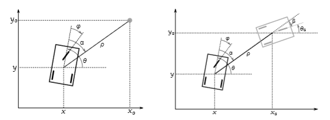
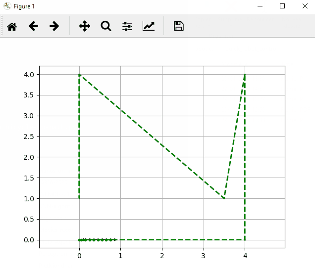

# Some Robotics
Compilation of some work done in robotics course at ENSTA ParisTech.

---

## 1. Control of unicycle and bicycle robots (by David Filliat)

My implementations of very simple control methods, based on PID controller, for the control of unicycle and bicycle robots.

  
  
**Bicycle following a path:**  
  

## 2. ROS Exercices

My solutions to several exercices of the course "*ROS in 5 Days*" from the [robot ignite learning platform](https://www.robotigniteacademy.com)

### Topics
  
Using *Topics* to make a robot avoid walls.  
  
### Services
  
Using *Services* to make a BB8 robot move in square.  
